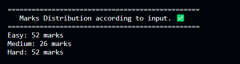

# Question Paper Generator

This script is designed to generate a question paper based on user input for total marks and difficulty distribution. It uses a question bank stored in a separate file and allows users to manually add questions to fulfill any remaining marks.

## Table of Contents
- [Features](#features)
- [Prerequisites](#prerequisites)
- [Usage](#usage)
- [Screenshots](#screenshots)


## Features

- User-friendly CLI interface for input.
- Random selection of questions based on specified difficulty distribution.
- Manual addition of questions to fulfill remaining marks.
- Question bank is updated with new questions.

## Prerequisites

- Node.js installed on your machine.
- Basic understanding of the command line.

## Usage

1. Clone the repository:

   ```bash
   git clone https://github.com/your-username/question-paper-generator.git
2. Install dependencies:

   ```bash
   npm install
3. Run the script:

   ```bash
   node main.js
4. Follow the prompts to input total marks and difficulty distribution percentages.
5. Review the generated question paper and manually add questions if needed.

## Screenshots

### User-Input:
- Enter the total marks and percentage distribution according to the difficulty.
 


### Calculated Marks based on percentage:




### Prepared question paper:
- The script also calculates the remaining marks if the algorithm is unable to find questions to meet the specified criteria. In such cases, users have the option to manually add questions to fulfill the remaining marks as needed.


### Final Question paper:


*Congratulations!! Your question paper is ready.*


   
